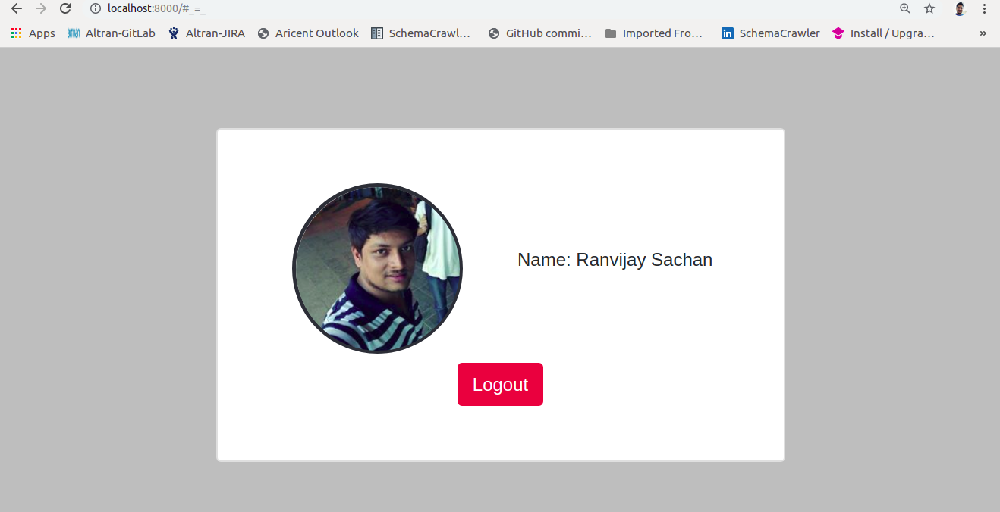

## Introduction

This is a demo repository to teach how to set up social authentication using social-auth-app-django library. 

## Requirements
* Python3
* Django2
* Django social auth

## Running the application
1. Clone the project to your machine ```[git clone https://github.com/ranvijay-sachan/django_social_auth.git]```
2. Navigate into the diretory ```[cd django_social_auth]```
3. Install the dependencies ```[pip install -r requirements.txt]```
4. Update the `settings.py` file with your keys from [Facebook](https://developers.facebook.com/apps).
5. Start the backend server ```[python manage.py runserver]```
6. Visit the application on the browser - [http:localhost:8000](http:localhost:8000)
7. Fb setting
   ```py
   SOCIAL_AUTH_FACEBOOK_KEY = ''
   SOCIAL_AUTH_FACEBOOK_SECRET = ''
   SOCIAL_AUTH_FACEBOOK_SCOPE = ['email', 'user_link']
   SOCIAL_AUTH_FACEBOOK_PROFILE_EXTRA_PARAMS = {
   'fields': 'id, name, email, picture.type(large), link'
   }
   SOCIAL_AUTH_FACEBOOK_EXTRA_DATA = [
    ('name', 'name'),
    ('email', 'email'),
    ('picture', 'picture'),
    ('link', 'profile_url'),
   ]
   ```

## Built With

